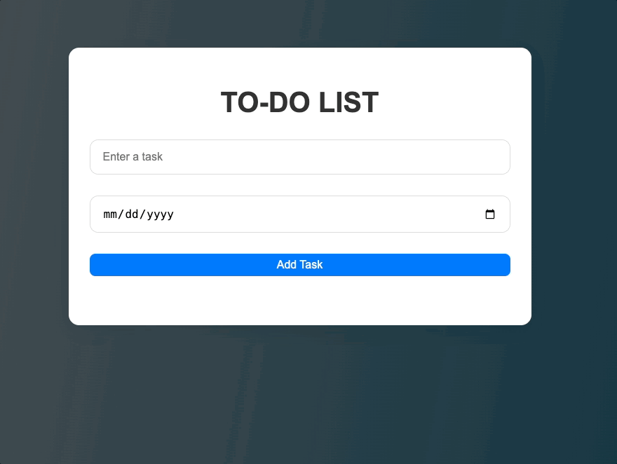

# ToDoAppAwsTwoTier

A simple two-tier To-Do application built with Node.js and vanilla JavaScript, designed for AWS deployment.

## Features
- Add, view, update, and delete tasks
- Set due dates for tasks
- Mark tasks as completed
- Responsive web UI
- Backend API with MySQL database

## Project Structure
```
index.js           # Node.js backend (Express)
package.json       # Project dependencies
public/
  index.html       # Main HTML page
  script.js        # Frontend JS logic
  style.css        # App styles
```

## Getting Started

### Prerequisites
- Node.js (v14+)
- MySQL database

### Installation
1. Clone the repository:
   ```sh
   git clone <repo-url>
   cd ToDoAppAwsTwoTier
   ```
2. Install dependencies:
   ```sh
   npm install
   ```
3. Configure your MySQL database connection in `index.js`.
4. Start the server:
   ```sh
   npm run dev
   ```
5. Open `public/index.html` in your browser.

## API Endpoints
- `POST /tasks` - Add a new task
- `GET /tasks` - Get all tasks
- `GET /tasks/:id` - Get a task by ID
- `PUT /tasks/:id` - Update a task
- `DELETE /tasks/:id` - Delete a task

## Deployment
This app is designed for easy deployment on AWS EC2 or Elastic Beanstalk. Ensure your database is accessible and environment variables are set for production.


